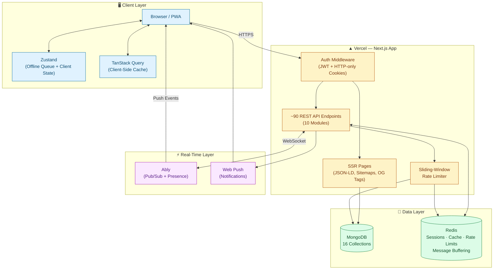
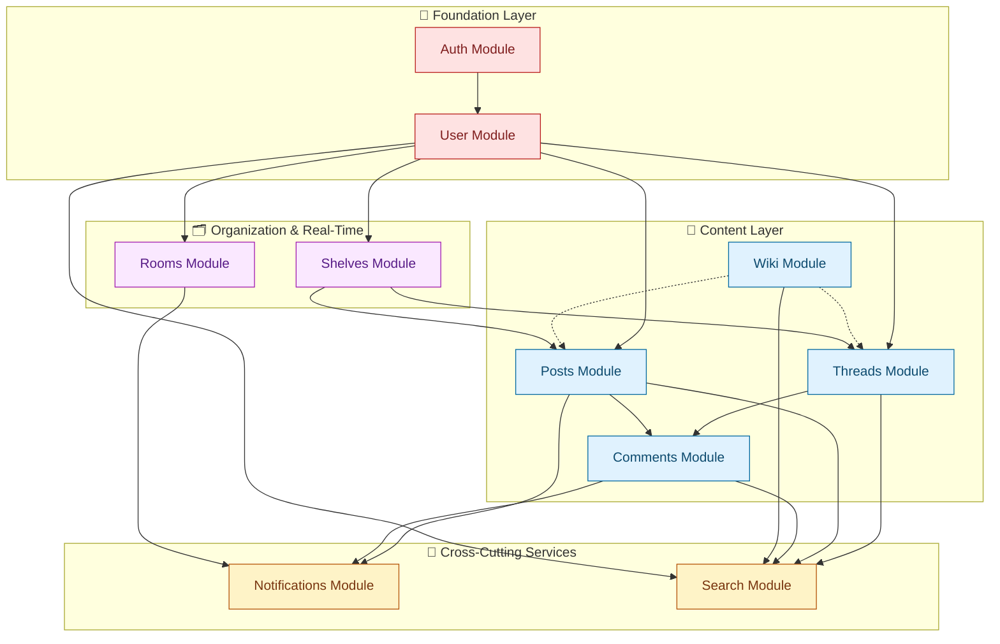
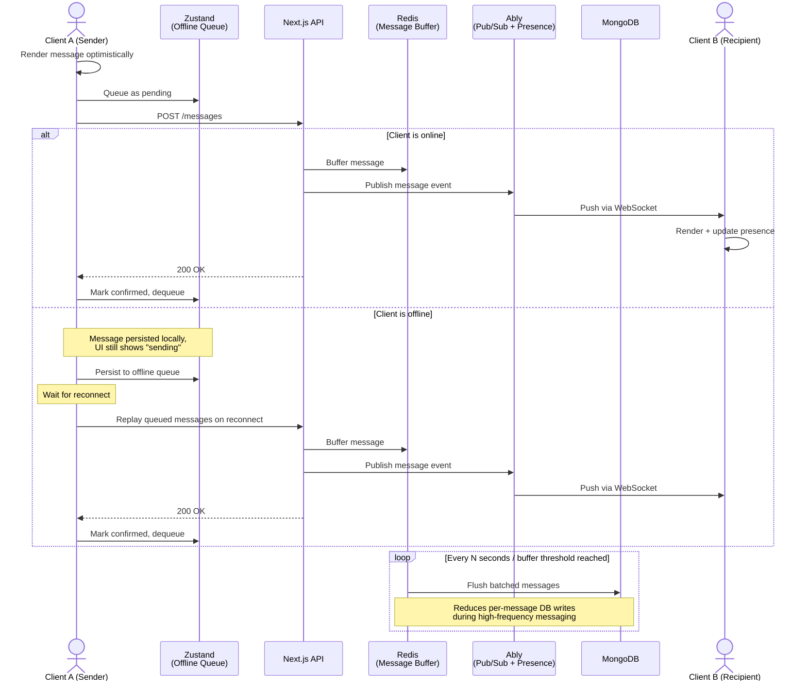
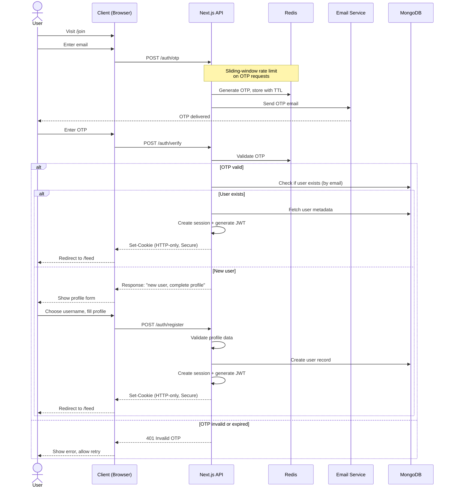

<div align="center">

# 🎬 Parlocula

**A community-based social platform for movie & show enthusiasts**

Built from the belief that cinema deserved a dedicated space to discuss, organize, and experience films beyond short-form social content.

[](#)
[](#)
[](#)
[](#)
[](#)
[](#)

[Live Demo](https://parlocula.vercel.app) · [Report Bug](https://parlocula.vercel.app/settings/report) · [Request Feature](https://parlocula.vercel.app/settings/feedback)

</div>

## Table of Contents

- [Overview](#overview)
- [Key Features](#key-features)
- [System Architecture](#system-architecture)
- [Module Architecture](#module-architecture)
- [Real-Time Messaging](#real-time-messaging)
- [Authentication](#authentication)
- [Performance & Accessibility](#performance--accessibility)
- [Tech Stack](#tech-stack)
- [Architecture Evolution](#architecture-evolution)
- [Getting Started](#getting-started)
- [License](#license)

---

## Overview

Parlocula is a 10-module distributed system spanning **~90 REST API endpoints**, **16 MongoDB collections**, and **~400 React components**, publicly deployed on Vercel. It lets people discuss, organize, and experience films together — threads, posts, curated "shelves," real-time discussion rooms, and a shared wiki for movies and shows.

This README documents the system's architecture, key engineering decisions, and the tradeoffs behind them.

## Key Features

- **Real-Time Messaging (1:1 & group)** — optimistic UI updates, live presence, offline persistence, and background sync, with Redis-based message buffering to reduce database load during high-frequency activity.
- **Offline-First Architecture** — feeds, messaging, profiles, trending content, and collaborative interactions all work offline. Pending actions (posts, reactions, messages) persist locally via Zustand and survive an app close or dropped connection.
- **Performance Engineering** — ~90% Google PageSpeed score and GTmetrix Grade A across nearly all public pages, via SSR, JSON-LD structured data, dynamic sitemaps, canonical URLs, and optimized Open Graph metadata.
- **Caching & Data Layer** — Next.js framework-level caching for read-heavy routes, paired with Redis for high-frequency operations (sessions, feed generation, rate limiting, message buffering).
- **Abuse Prevention** — sliding-window rate limiting on authentication and content-creation endpoints.
- **Passwordless Authentication** — hybrid JWT + HTTP-only cookie session model, with full user-controlled session termination.
- **Accessibility** — semantic HTML and ARIA attributes throughout, 95–100% Accessibility score on Google PageSpeed Insights.
- **Progressive Web App** — installable, responsive, native-like mobile UX with offline access to core surfaces.

## System Architecture

High-level view of how the client, Next.js application layer, data layer, and real-time layer fit together.



## Module Architecture

The system is organized into four layers by dependency direction — foundation, content, organization/real-time, and cross-cutting services — rather than 10 flat, unrelated features.



Dashed arrows indicate a loose reference (e.g., Wiki entries linked from Threads/Posts) rather than a hard functional dependency.

## Real-Time Messaging

Optimistic UI, offline persistence, and Redis-based message buffering keep conversations responsive and consistent under unreliable network conditions.



Real-time delivery via Ably is not gated by database writes — Redis buffers and periodically flushes to MongoDB in batches, so a burst of messages doesn't turn into a burst of database operations.

## Authentication

A passwordless flow: email → OTP → session. Session cookies are only issued after both OTP validity and (for new users) profile-data validity are confirmed.



Tokens are never exposed to client-side JavaScript — sessions live in HTTP-only, Secure cookies, and users have full control to terminate active sessions at any time.

## Performance & Accessibility

| Metric | Score |
|---|---|
| Google PageSpeed | ~90% across nearly all public pages |
| GTmetrix | Grade A |
| Accessibility (PageSpeed Insights) | 95–100% |

Achieved via server-side rendering, JSON-LD structured data, dynamic sitemaps, canonical URLs, optimized Open Graph metadata, semantic HTML, and ARIA attributes throughout the UI.

Client-side responsiveness is further improved through debouncing/throttling on high-frequency interactions, optimistic rendering, infinite scrolling, background synchronization, and selective background refetching.

## Tech Stack

| Layer | Technology |
|---|---|
| Framework | Next.js, TypeScript |
| Styling | Tailwind CSS |
| Database | MongoDB (16 collections) |
| Cache / Buffering | Redis & Next Js built-in caching |
| Server State | TanStack Query |
| Client State | Zustand |
| Real-Time | Ably |
| Validation | Zod |
| Notifications | Web Push |
| Deployment | Vercel |

## Architecture Evolution

One of the largest architectural shifts during development came from understanding how Next.js manages rendering and caching across the client/server boundary. Early data-fetching strategies conflicted with framework caching behavior, which led to several redesigns before settling on a predictable model built on server-side rendering, cache revalidation, cache tags, and client-side synchronization.

## Getting Started

> **Note:** fill in the specifics for your actual repo before publishing.

```bash
# Clone the repository
git clone https://github.com/SadiqNaqvi/parlocula.git
cd parlocula

# Install dependencies
npm install

# Set up environment variables
cp .env.example .env.local
# Fill in: MONGODB_URI, REDIS_URL, ABLY_API_KEY, JWT_SECRET, EMAIL_* , VAPID_* (Web Push)

# Run the development server
npm run dev
```

Visit `http://localhost:3000` to view the app locally.

## License

This project is licensed under the [MIT License](LICENSE).

---

<div align="center">

Built by Sadiq Naqvi · [LinkedIn](https://linkedin.com/in/sadiqnaqvi) · [Portfolio](https://naqvisadiq.netlify.app)

</div>